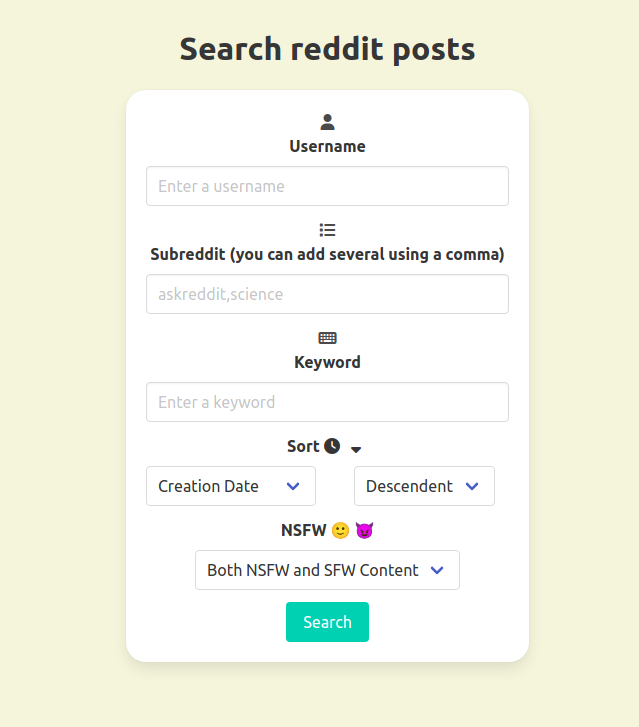

# PushShift User Searcher

Ever wanted to check if a reddit user is trustworthy? Or maybe they removed a post you really really liked, or had info you desperately need?

Now you can easily scan through their submission history 😎

Check it out here: https://pushift-user-searcher.vercel.app/

You can filter your search by:

-   Specifying one or more subreddits
-   Keywords
-   NSFW or SFW

You can also sort the results by:

-   Creation date
-   Upvotes
-   Comment number

All this ascending or descending.

## Screenshots

# Tools I Used

-   [React](https://reactjs.org/)
-   [Bulma](https://bulma.io/)
-   [Bulma Components](https://github.com/couds/react-bulma-components)
-   [Sass](https://github.com/sass/sass)
-   [Axios](https://github.com/axios/axios)

# TODO

-   [] Add support for Comments.
-   [] Integrate the Universal Scammer List.
-   [] You tell me!
